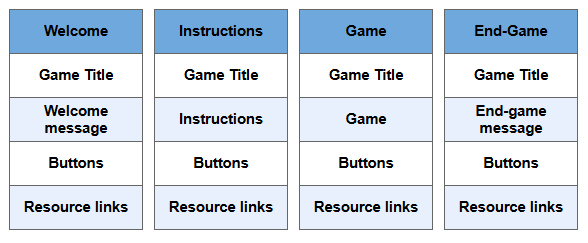
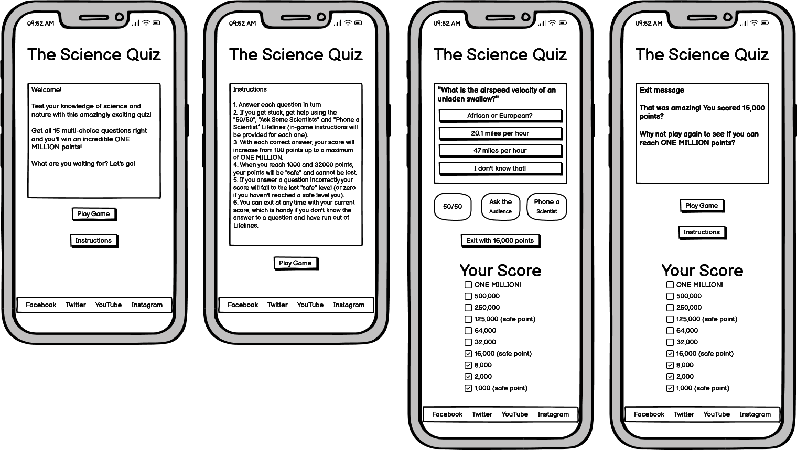
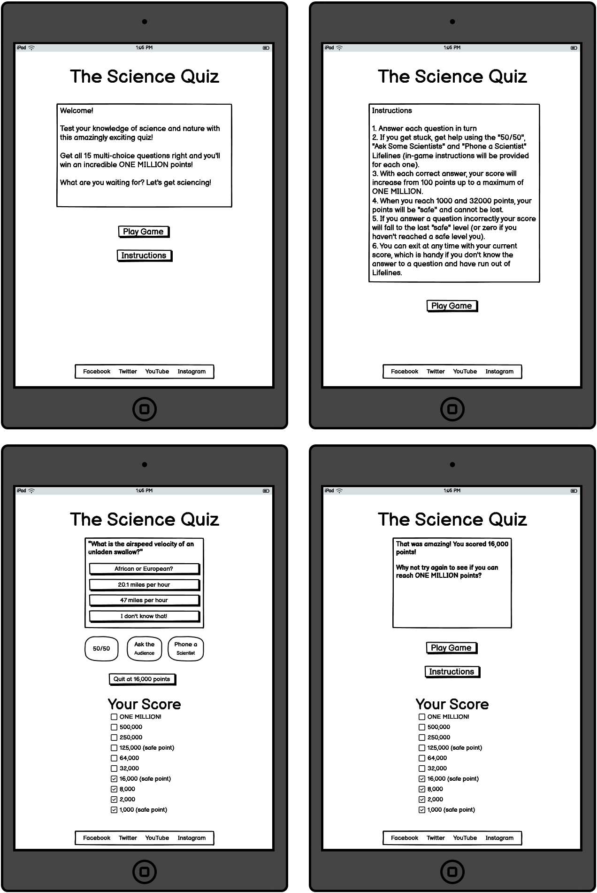
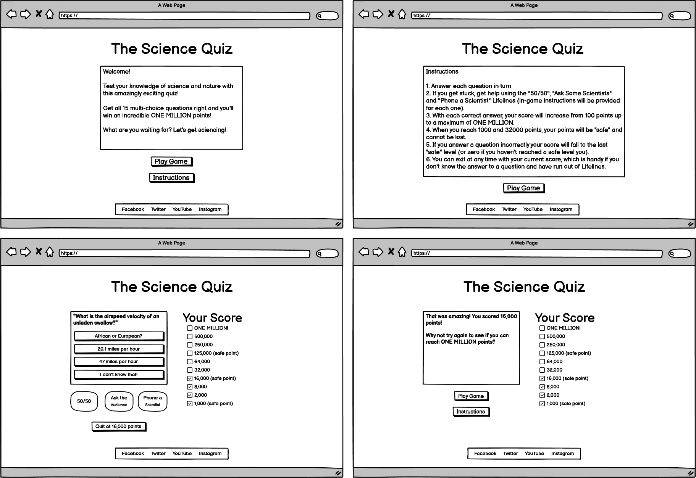
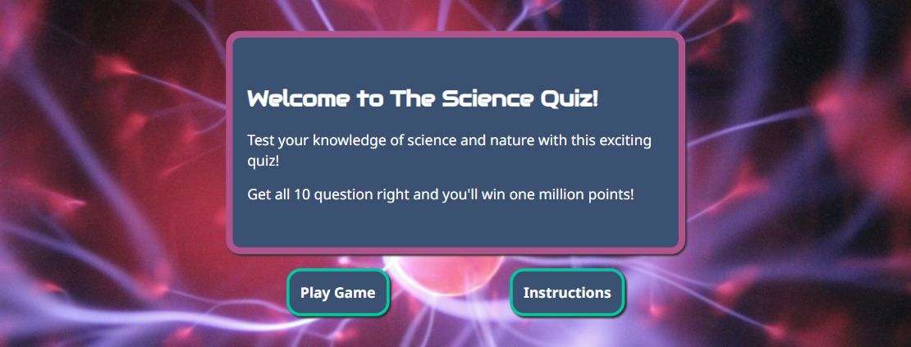
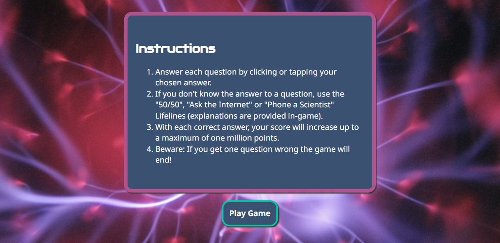
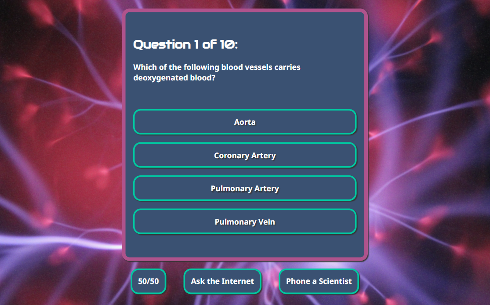

# The Science Quiz

The Science Quiz is an online game based on the popular TV quiz, Who Wants to Be a Millionaire.

The game aims to inspire people to take an interest in science and the natural sciences in particular, from chemistry to physics, biology, geology, climate and more.

Each game consists of a series of questions. Players gain points with each correct answer, with a maximum score of one million points, but if they answer incorrectly the game immediately ends. Players can get help if they run into a difficult question, by pressing the 50/50, Phone a Scientist and Ask the Internet buttons.

## User Experience Design

The user experience was designed using the "five planes" method.

### Strategic Plane

#### Site Goals

- Primary goal:
  - To inspire one million people to take an interest in the natural sciences
- Secondary goals:
  - To present science as fun, fascinating and challenging
  - To promote science through an engaging, enjoyable and accessible game
  - To provide visitors with links to respected science-related resources

#### User goals

- Primary goal:
  - To play a fun game
- Secondary goals:
  - To find out how much they know about natural science topics
  - To learn some new scientific-related facts about the world

### Scope Plane

#### User stories

1. As a user, I want to see a visually appealing website that looks good on various screen sizes and is easy to navigate, so I'm not put off by a poor user experience.
1. As a user, I want to play a game that is fun, challenging and educational.
1. As a user, I want to be able to read the game’s instructions so I know how to play.
1. As a user, I want clear feedback when I interact with the game, so I know how well (or badly) I’m doing.
1. As a user, I want to see links to educational resources so I can learn more about the natural sciences.

### Structure Plane

To fulfil the user stories, the site has various sections:

- Game title
- Welcome message
- Instructions
- The Game
- End-game message
- Buttons (various)
- Resource links

The site has a single page, with the sections listed above either visible or hidden based on which one of four “modes” the site is in: (1) Welcome, (2) Instructions, (3) Game and (4) End-Game.

### Skeleton Plane

Wireframes were developed for each of the site's four "modes" and for the three main screen sizes (mobile, tablet, desktop).

#### Mobile Wireframes

#### Tablet Wireframes

#### Desktop Wireframes

### Surface Plane

#### Colour palette

The colour palette is based on colours extracted from the game's visually striking background image, which looks like a ball or energy or a neuron firing.

- #af538c (a shade of pink) is the primary colour
- #3a5172 (a shade of slate grey) is the secondary colour
- #fff (white) is used for text
- #333 (dark grey) is for shadows

The game also uses three contrasting colours to provide feedback to the user; for example, when the user answers a questions correctly or incorrectly.

- #00c8a1 (a shade of green)
- #0080f9 (a shade of blue)
- #d45179 (a shade of red)

#### Custom fonts

The site uses two custom fonts from [Google Fonts](https://fonts.google.com/).

- [Audiowide](https://fonts.google.com/specimen/Audiowide): Used for headings
- [Noto Sans](https://fonts.google.com/noto/specimen/Noto+Sans): Used for all other text

#### Images

The background image was chosen for its striking portrayal of a biological or electrical event, which is intended to inspire users to take an active interest in science.

#### Content

As a simple quiz game, the site has very little in the way of written content, other than the quiz's questions and answers. The questions and answers are loaded from a freely available web API.

- [Open Trivia Database](https://opentdb.com/)
- [Open Trivia Database API URL generator](https://opentdb.com/api_config.php)
- [API URL used by the game](https://opentdb.com/api.php?amount=10&category=17&difficulty=easy&type=multiple)

## Features

### Existing Features

#### Header Section

- The site contains a header section at the top of the page.
- It contains the name of the game in a large font size using the custom heading font. Text is in white.
- The background uses the primary pink colour, which is also used in the footer and other parts of the site.
- This section is useful to users because it clearly tells them which site they are on and what type of game they're about to play.

#### Welcome Section

- This section contains a welcome message shown to users when they first visit the site and when they start a new game.
- It has a striking background image which was chosen to catch the attention of visitors within a few seconds, to the conversion rate from visitor to player.
- Text is in white and the header and body text use the site's customer header and body fonts.
- The section's border is in the primary pink colour to attract attention, while the text area's background is in the secondary grey colour so as not to overly distract from the text.
- Below the welcome message there are two buttons to start a new game and to view the instructions. These buttons have a contrasting green border to visually differentiate them from the welcome message above.
- This section is useful to users because it gives them a more detailed explanation of what the game is and an outline of how it works. It also provides interactive buttons where they can start a new game or view instructions.

#### Instructions Section

- This section contains the game's instructions and only becomes visible after the user has clicked on the Instructions button. 
- The game is relatively simple, so the instructions are deliberately concise rather than overly comprehensive.
- It uses the same styles as the Welcome Section, with the same pink border, grey background, white text, custom fonts and button styling.
- Below the instructions there is one button to start a new game.
- This section is useful to users because it gives them enough detail to understand how to play the game, without being so long they get bored and leave the site.

#### Game Section

- This section contains the game, and only becomes visible after the user has clicked on the Play Game button.
- It uses the same styles as the Welcome and Instructions sections.
- It contains a heading, which shows users which of the ten questions they are currently on.
- It shows each question in turn, along with four possible answers, with each answer displayed within an answer button. Answer buttons use a contrasting green border to make them visually similar to the Play Game and Instructions buttons.
- When the user selects an answer button, the other buttons become semi-transparent to de-emphasise them. The selected button turns green if the answer is correct, otherwise it turns red (using the site's custom green and red colours). 
- After selecting an answer button, the user is shown a feedback message which informs them whether they were right or wrong and their current score. If the user was wrong, the correct answer button is highlighted in green. There is then a short pause before the next question auto-loads.
- There are three Lifeline buttons: 50/50, Ask the Internet, and Phone a Scientist. These provide help to the user in different ways (e.g. 50/50 disables two incorrect answer buttons), without giving the answer away. You can find more details about how the lifelines work in the Testing section below.
- This section is useful to users because it contains the interactive part of the game, which will entertain them and (hopefully) inspire them to take an interest in science.

#### Footer Section

#### 404 Error Page

### Future Features

## Testing

TBC: [TESTING.md](TESTING.md)

## Deployment

## Credits