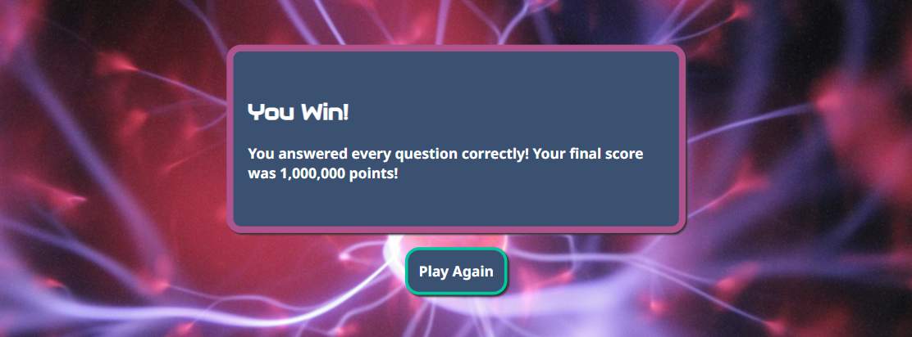
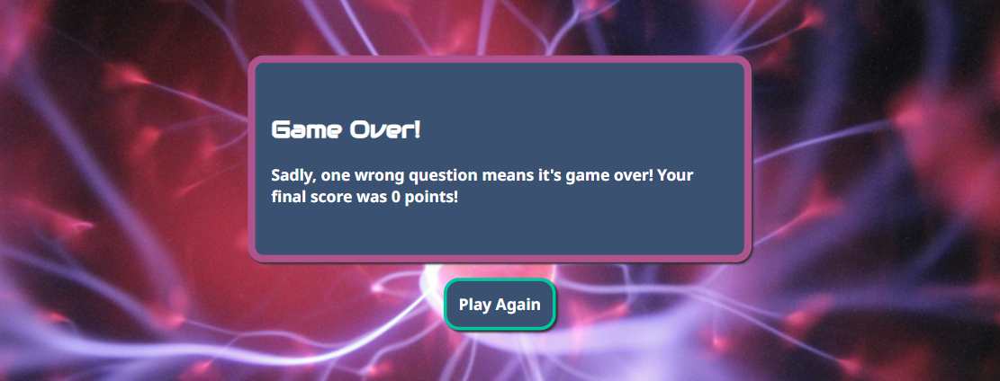
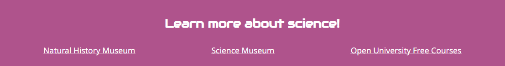
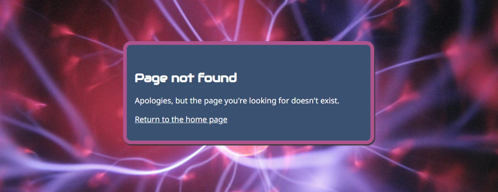

# The Science Quiz

The Science Quiz is an online game based on the popular TV quiz, Who Wants to Be a Millionaire.

The game aims to inspire people to take an interest in science and the natural sciences in particular, from chemistry to physics, biology, geology, climate and more.

Each game consists of a series of questions. Players gain points with each correct answer, with a maximum score of one million points, but if they answer incorrectly the game immediately ends. Players can get help if they run into a difficult question, by pressing the 50/50, Phone a Scientist and Ask the Internet buttons.

## User Experience Design

The user experience was designed using the "five planes" method.

### Strategic Plane

#### Site Goals

- Primary goal:
  - To inspire one million people to take an interest in the natural sciences
- Secondary goals:
  - To present science as fun, fascinating and challenging
  - To promote science through an engaging, enjoyable and accessible game
  - To provide visitors with links to respected science-related resources

#### User goals

- Primary goal:
  - To play a fun game
- Secondary goals:
  - To find out how much they know about natural science topics
  - To learn some new scientific-related facts about the world

### Scope Plane

#### User stories

1. As a user, I want to see a visually appealing website that looks good on various screen sizes and is easy to navigate, so I'm not put off by a poor user experience.
1. As a user, I want to play a game that is fun, challenging and educational.
1. As a user, I want to be able to read the game’s instructions so I know how to play.
1. As a user, I want clear feedback when I interact with the game, so I know how well (or badly) I’m doing.
1. As a user, I want to see links to educational resources so I can learn more about the natural sciences.

### Structure Plane

To fulfil the user stories, the site has various sections:

- Game title
- Welcome message
- Instructions
- The Game
- End-game message
- Buttons (various)
- Resource links

The site has a single page, with the sections listed above either visible or hidden based on which one of four “modes” the site is in: (1) Welcome, (2) Instructions, (3) Game and (4) End-Game.

### Skeleton Plane

Wireframes were developed for each of the site's four "modes" and for the three main screen sizes (mobile, tablet, desktop).

#### Mobile Wireframes

#### Tablet Wireframes

#### Desktop Wireframes

### Surface Plane

#### Colour palette

The colour palette is based on colours extracted from the game's visually striking background image, which looks like a ball or energy or a neuron firing.

- #af538c (a shade of pink) is the primary colour
- #3a5172 (a shade of slate grey) is the secondary colour
- #fff (white) is used for text
- #333 (dark grey) is for shadows

The game also uses three contrasting colours to provide feedback to the user; for example, when the user answers a question correctly or incorrectly.

- #00a887 (a shade of green)
- #0080f9 (a shade of blue)
- #d45179 (a shade of red)

#### Custom fonts

The site uses two custom fonts from [Google Fonts](https://fonts.google.com/).

- [Audiowide](https://fonts.google.com/specimen/Audiowide): Used for headings
- [Noto Sans](https://fonts.google.com/noto/specimen/Noto+Sans): Used for all other text

#### Images

A background image was chosen for its striking portrayal of a biological or electrical event, which is intended to inspire users to take an active interest in science.

#### Content

As a simple quiz game, the site has very little in the way of written content, other than the quiz's questions and answers. The questions and answers are loaded from a freely available web API.

- [Open Trivia Database](https://opentdb.com/)
- [Open Trivia Database API URL generator](https://opentdb.com/api_config.php)
- [API URL used by the game](https://opentdb.com/api.php?amount=10&category=17&difficulty=easy&type=multiple)

## Technologies used

### Languages

- [HTML](https://developer.mozilla.org/en-US/docs/Web/HTML)
- [CSS](https://developer.mozilla.org/en-US/docs/Web/CSS)
- [JavaScript](https://developer.mozilla.org/en-US/docs/Web/JavaScript)

## Features

### Existing Features

#### Game Title Section (header)

- The site contains a header section at the top of the page.
- It contains the title of the game in a large font size using the custom heading font. Text is in white.
- The background uses the primary pink colour, which is also used in the footer and other parts of the site.
- This section is useful to users because it clearly tells them which site they are on and what type of game they're about to play.

#### Welcome Section

- This section contains a welcome message shown to users when they first visit the site and when they start a new game.
- It has a striking background image which was chosen to catch the attention of visitors within a few seconds, to the conversion rate from visitor to player.
- Text is in white and the header and body text use the site's customer header and body fonts.
- The section's border is in the primary pink colour to attract attention, while the text area's background is in the secondary grey colour so as not to overly distract from the text.
- Below the welcome message there are two buttons to start a new game and to view the instructions. These buttons have a contrasting green border to visually differentiate them from the welcome message above.
- This section is useful to users because it gives them a more detailed explanation of what the game is and an outline of how it works. It also provides interactive buttons where they can start a new game or view instructions.

#### Instructions Section

- This section contains the game's instructions and only becomes visible after the user has clicked on the Instructions button. 
- The game is relatively simple, so the instructions are deliberately concise rather than overly comprehensive.
- It uses the same styles as the Welcome Section, with the same pink border, grey background, white text, custom fonts and button styling.
- Below the instructions there is one button to start a new game.
- This section is useful to users because it gives them enough detail to understand how to play the game, without being so long they get bored and leave the site.

#### Game Section

- This section contains the game, and only becomes visible after the user has clicked on the Play Game button.
- It uses the same styles as the Welcome and Instructions sections.
- It contains a heading, which shows users which of the ten questions they are currently on.
- It shows each question in turn, along with four possible answers, with each answer displayed within an answer button. Answer buttons use a contrasting green border to make them visually similar to the Play Game and Instructions buttons.
- When the user selects an answer button, the other buttons become semi-transparent to de-emphasise them. The selected button turns green if the answer is correct, otherwise it turns red (using the site's custom green and red colours). 
- After selecting an answer button, the user is shown a feedback message which informs them whether they were right or wrong and their current score. If the user was wrong, the correct answer button is highlighted in green. There is then a short pause before the next question auto-loads.
- There are three Lifeline buttons: 50/50, Ask the Internet, and Phone a Scientist. These provide help to the user in different ways (e.g. 50/50 disables two incorrect answer buttons), without giving the answer away. You can find more details about how the lifelines work in the Testing section below.
- This section is useful to users because it contains the interactive part of the game, which will entertain them and (hopefully) inspire them to take an interest in science.

#### End Game Section

- This section tells users whether they have won or lost the game. If the user answers any of the game's ten questions incorrectly, they lose, otherwise, they win.
- It uses the same styles as the Welcome, Instructions and Game sections.
- It contains a heading which clearly shows the user whether they won or lost, and some supporting text along with the user's final score.
- This section also includes a Play Again button, so the user can start a new game if they wish. The Play Again button takes the user back to the Welcome section.
- This section is useful to users because it clearly informs them of their win or loss, as well as their final score, and it enables them to quickly enter a new game.

**End Game section when the user wins the game**

**End Game section when the user loses the game**

#### Resources Section (footer)

- This section contains resources that users may find useful in their newly inspired pursuit of all things science.
- It uses the same styles as the header (Game Title) section, with white text and a custom pink background. The text uses the site's custom heading and body fonts.
- It contains a heading and links to three highly respected science-related sites, each of which opens in a new tab.
- This section is useful to users because it gives them immediate access to free education content to help them take their new-found love of science to the next level.

#### 404 Error Page

- This page is shown if the user enters an invalid URL.
- It is based on the homepage (index.html) and uses the same styles throughout.
- It contains a simple error message and a link to return to the homepage.
- This page is useful to users because it tells them when they've visited an invalid URL, while retaining the same styles as the site's valid page.

### Future Features

#### Score Ladder

- The wireframes show a "score ladder" where users can see how far they've climbed along the journey from zero to the maximum of one million points.
- Due to time constraints, this feature has been deferred to a future release.

#### Player Names, Multiple Players and High Scores

- Although not in the initial design, there is clearly the potential to add additional functionality, such as multiple players and high scores, as well as personalisation by allowing users to enter a username.
- These are all good feature candidates for future releases.

## Testing

The site was thoroughly tested, with all tests documented in [TESTING.md](TESTING.md).

## Deployment

The Science Quiz has been deployed via GitHub pages.

- In the [GitHub repository](https://github.com/John-Kingham/science-quiz), navigate to the "Settings" tab.
- In Settings, click on the "Pages" link from the menu on the left.
- From the "Build and deployment" section, click the drop-down called "Branch", and select the **main** branch, then click "Save".
- The page will be automatically refreshed with a message display to indicate the successful deployment.
- Allow up to 5 minutes for the site to fully deploy.

The live link can be found on the [The Science Quiz GitHub Page](https://john-kingham.github.io/science-quiz).

### Local Development

This project can be cloned or forked to make a local copy on your own system.

#### Cloning

You can clone the repository using these steps:

1. Go to the [GitHub repository](https://github.com/John-Kingham/science-quiz).
2. Click on the green "Code" button near the top, above the commits and files.
3. Select whether you prefer to clone using "HTTPS", "SSH", or "GitHub CLI", and click the "copy to clipboard" icon to copy the URL to your clipboard.
4. Within your IDE, open "Git Bash" or "Terminal".
5. Change the current working directory to the location where you want the cloned directory.
6. In your IDE Terminal, type the following command to clone the repository:
	- `git clone https://github.com/John-Kingham/science-quiz.git`
7. Press "Enter" to create your local clone.

#### Forking

By forking the GitHub Repository, you make a copy of the original repository on your GitHub account to view and/or make changes without affecting the original repository. You can fork this repository by using the following steps:

1. Log in to GitHub and locate the [GitHub Repository](https://github.com/John-Kingham/science-quiz).
2. At the top of the Repository, just below the "Settings" button on the menu, locate and click the "Fork" Button.
3. Once clicked, you should now have a copy of the original repository in your own GitHub account.

### Local VS Deployment

There are no remaining major differences between the local version when compared to the deployed version online.

## Credits

### User Experience Design

- I used the five planes method (Strategy, Scope, Structure, Skeleton, Surface), as detailed in [The Elements of User Experience](http://www.jjg.net/elements/).

#### Structure Plane

- I used [Google Sheets](https://docs.google.com/spreadsheets) to create the site structure diagram.

#### Skeleton Plane

- I built the wireframes using [Wireframe.cc](https://www.wireframe.cc).

#### Surface Plane

##### Images

The site's background image was downloaded from [UnSplash](https://unsplash.com/), which offers free images for private or commercial use without attribution. Here is the direct links to the image on Unsplash:

- [A ball of energy with electricity beaming all over the place](https://unsplash.com/photos/purple-and-pink-plasma-ball-OgvqXGL7XO4)

##### Colour Palette

- The colour scheme was based on the site's background image (details below). 
- I used Microsoft Paint to extract the site's primary pink colours from the image.
- I used [ColorSpace](https://mycolor.space/) to generate a palette of colours based on the site's primary pink colour.

##### Favicons

- I used [Gauger.io](https://gauger.io/fonticon/) to create a favicon image using its "atom" icon.
- I used [Favicon.io](https://favicon.io/) to convert the favicon into multiple favicon formats.

#### Fonts

- I used custom fonts from [Google Fonts](https://fonts.google.com/). The exact fonts are listed at the top of this readme.

##### Content

- The questions and answers are pulled from [Open Trivia Database](https://opentdb.com/), which my mentor (noted below) suggested.

### Construction

#### HTML, CSS and JavaScript

- I wrote the site's code using [Visual Studio Code](https://code.visualstudio.com/).
- I used [Mozilla Developer Network](https://developer.mozilla.org/), [W3Schools](https://www.w3schools.com/), [Code Institute](https://codeinstitute.net/), [Codecademy](https://www.codecademy.com/) and [Microsoft Copilot](https://copilot.microsoft.com/) for general reference.
- I learned about JavaScript's fetch function and error handling from my mentor and Codecademy.
- Microsoft Copilot showed me how to disable buttons using CSS, and how linear gradients could be used for the "Ask the Internet" visual effects.
- Although I used various sites for reference, no external code was copy/pasted into the project or copied verbatim. 

### Documentation

- I used [Code Institute's README.md template](https://github.com/Code-Institute-Solutions/readme-template/blob/master/README.md) as the starting point for this document.
- I used [Am I Responsive](https://ui.dev/amiresponsive) to generate the multi-screen image shown at the start of the README.
- I used [Green Shot](https://getgreenshot.org/) for screenshots.

## People

- I would like to thank my mentor, [Simen Daehlin](https://github.com/Eventyret).