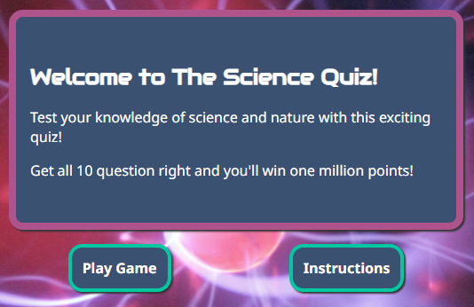
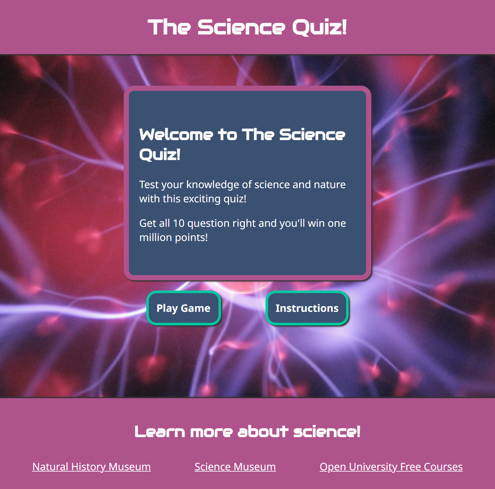
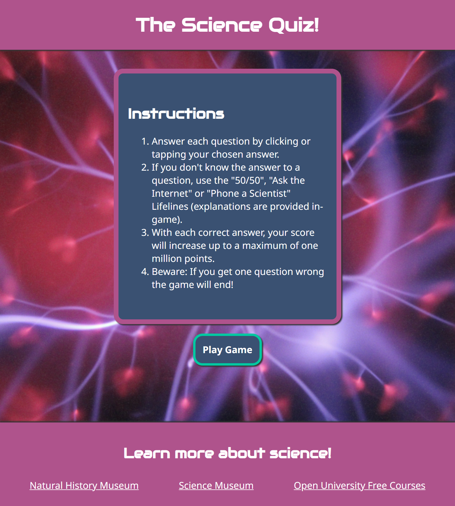
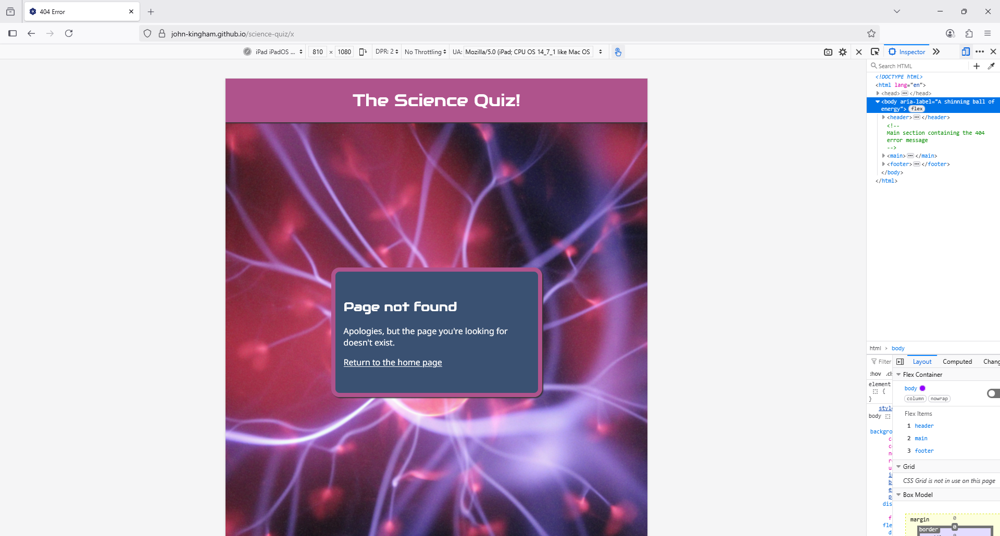

# The Science Quiz - Manual Testing

## Functionality

### Links

#### Homepage Links

|Feature|Expect|Action|Result|
|---|---|---|---|
|Footer link: Natural History Museum|When clicked, the Natural History Museum homepage opens in a new tab|Clicked the link|As expected|
|Footer link: Science Museum|When clicked, the Science Museum homepage opens in a new tab|Clicked the link|As expected|
|Footer link: Open University Free Courses|When clicked, the Open University's OpenLearn homepage opens in a new tab|Clicked the link|As expected|

#### 404 Error Page Links

|Feature|Expect|Action|Result|
|---|---|---|---|
"Return to the home page" link|When clicked, the homepage opens|Clicked the link|As expected|
|Footer link: Natural History Museum|When clicked, the Natural History Museum homepage opens in a new tab|Clicked the link|As expected|
|Footer link: Science Museum|When clicked, the Science Museum homepage opens in a new tab|Clicked the link|As expected|
|Footer link: Open University Free Courses|When clicked, the Open University's OpenLearn homepage opens in a new tab|Clicked the link|As expected|

### Game Functionality

|Feature|Expect|Action|Result|Image
|---|---|---|---|---|
|"Instructions" button|When clicked, the instructions are displayed|Clicked the button|As expected||
|"Play Game" button|When clicked, the game begins and the first question is shown|Clicked the button|As expected||
|Question counter|When each new question is displayed, a visible counter is incremented by one so users can track their progress|Displayed next question|As expected||
|"50/50" button|When clicked, a description of the lifeline is displayed and two random incorrect answers and the 50/50 button become semi-transparent and disabled| Clicked the button| As expected||
|"Ask the Internet" button|When clicked, a description of the lifeline is displayed, the Internet's "votes" are shown on each answer button by the amount of green shading and the "Ask the Internet" button becomes semi-transparent and disabled|Clicked the button|As expected||
|"Phone a Scientist" button| When clicked, a description of the lifeline is displayed, one answer is highlighted with a blue border and the "Phone a Scientist" button becomes semi-transparent and disabled|Clicked the button|As expected||
|Multiple lifelines|When multiple lifelines are selected, their functional and visual effects are combined| Clicked multiple lifeline buttons|As expected||
|Correct answer|When the correct answer is clicked, a message will be shown informing the user of their score, the correct answer will turn green, incorrect answers will become semi-transparent and all buttons will be temporarily disabled|Clicked button|As expected||
|Incorrect answer|When an incorrect answer is clicked, a message will be shown informing the user that they were wrong, the incorrect answer will turn red, the correct answer will turn green, other incorrect answers will become semi-transparent and all buttons will be temporarily disabled|Clicked button|As expected||
|Win message|When the user answers all questions correctly, a message is shown informing them of their win and score|Answered all questions correctly|As expected||
|Lose message|When the user answers a question incorrectly, a message is shown informing them that they have lost the game|Answered a question incorrectly|As expected||
|"Play Again" button|When clicked, the game's welcome area is shown|Clicked the button|As expected||

### Page Not Found (404 Errors)

|Feature|Expect|Action|Result|Image
|---|---|---|---|---|
|Bespoke 404 error page|If the user visits an invalid URL within the site, the bespoke 404 error page is shown|Visited an invalid URL within the site|As expected||

## Responsiveness

|Page|Section|Mobile Responsive?|Tablet Responsive?|Desktop Responsive?|
|---|---|---|---|---|
|index.html|Welcome|Yes|Yes|Yes|
|index.html|Instructions|Yes|Yes|Yes|
|index.html|Game|Yes|Yes|Yes|
|index.html|Lose|Yes|Yes|Yes|
|index.html|Win|Yes|Yes|Yes|
|404.html|N/A|Yes|Yes|Yes|

### Screenshots

Welcome - Mobile

Welcome - Tablet

Welcome - Desktop

 

Instructions - Mobile

Instructions - Tablet

Instructions - Desktop

 

Game - Mobile

Game - Tablet

Game - Desktop

 

Lose - Mobile

Lose - Tablet

Lose - Desktop

 

Win - Mobile

Win - Tablet

Win - Desktop

 

404 - Mobile

404 - Tablet

404 - Desktop

## Browsers

The site's functionality and responsiveness were tested on Edge, Chrome and Firefox, as these are some of the most popular browsers.

|Test|Edge|Chrome|Firefox|
|---|---|---|---|
|index.html functionality as expected?|Yes|Yes|Yes|
|index.html responsiveness as expected?|Yes|Yes|Yes|
|404.html functionality as expected?|Yes|Yes|Yes|
|404.html responsiveness as expected?|Yes|Yes|Yes|

All of the screenshots in the sections above were taken on Edge. Rather than include every screenshot for every browser, here are a few screenshots from Chrome and Firefox showing similar results to Edge:

Welcome - Desktop - Chrome

Game - Mobile - Firefox

404 - Tablet - Firefox

## Code Validation

### HTML Validation

HTML was validated using the [W3C Markup Validation Service](https://validator.w3.org/).

#### index.html Validation

*Errors: None*

*Warnings: None*

*Info (6): Trailing slash on void elements (not fixed)*

- Trailing slashes are inserted by the Prettier formatting extension that I used in VS Code. Given that the point of using an opinionated auto-formatter is to standardise formatting and avoid formatting arguments, I decided to leave these trailing slashes in place, even though they are not considered best practice.

#### 404.html Validation

*Error: None*

*Warning (1): Possible misuse of aria-label (fixed)*

- This was caused by an aria-label attribute on the body element that describes the body element's background image. However, screen readers don't typically announce the body, as body background images should be decorative rather than informational. 
- I had already fixed this in index.html during development, but forgot to fix it in 404.html.
- I fixed this by removing the aria-label. 

*Info (6): Trailing slash on void elements (not fixed)*

- Trailing slashes are inserted by the Prettier formatting extension that I used in VS Code. Given that the point of using an opinionated auto-formatter is to standardise formatting and avoid formatting arguments, I decided to leave these trailing slashes in place, even though they are not considered best practice.

### CSS Validation

CSS validation was carried out using the [W3C CSS Validation Service](https://jigsaw.w3.org/css-validator/).

#### styles.css

*Error: None*

*Warning (4): Due to their dynamic nature, CSS variables are currently not statically checked*

- There are warnings about CSS variables not being statically checked by the validator. As the CSS variables have effectively been tested by the site's functional and visual tests, these warnings were ignored.

### JavaScript Validation

JavaScript validation was carried out using [JSHint](https://jshint.com/).

#### script.js

*Errors: None*

*Warnings: None*

## Colour Contrast

### White foreground (#fff), pink background (#af538c)

This colour combination is used in the header and footer.

*Normal text: Pass*

### White foreground (#fff), grey background (#3a5172)

This colour combination is used for buttons and the main content area.

*Normal text: Pass*

### White foreground (#fff), red background (#d45179)

This colour combination is used when a user chooses an incorrect answer. 

*Normal text: Fail*

*Large text: Pass*

- This colour combination fails with normal-sized text. The answer buttons originally had the default size of 16px (1rem), so this colour combination was unacceptable.
- To fix this, I increased the answer button font size to 20px (1.25rem), which is considered large text by the contrast checker. This colour combination passes the large text test.
- The answer buttons also have text shadows to further enhance the contrast. 

### White foreground (#fff), green background (#00a887)

This colour combination is used to highlight the correct answer button.

*Normal text: Fail*

*Large text: Pass*

- The site originally used a lighter shade of green (#00c8a1) which failed the contrast checks for normal and large text.
- To fix this, I changed it to a slightly darker shade of green that pass the large text test (answer buttons use large text).
- Answer buttons also have dark text shadows to further enhance the contrast.

## Lighthouse

## Unfixed Bugs