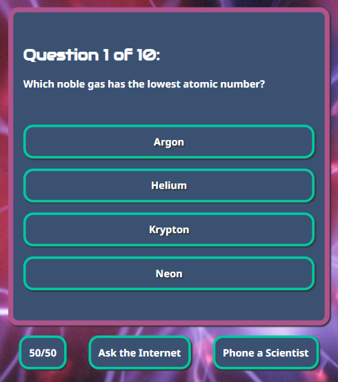

# The Science Quiz - Manual Testing

## Functionality

### Links

#### Homepage Links

|Feature|Expect|Action|Result|
|---|---|---|---|
|Footer link: Natural History Museum|When clicked, the Natural History Museum homepage opens in a new tab|Clicked the link|As expected|
|Footer link: Science Museum|When clicked, the Science Museum homepage opens in a new tab|Clicked the link|As expected|
|Footer link: Open University Free Courses|When clicked, the Open University's OpenLearn homepage opens in a new tab|Clicked the link|As expected|

#### 404 Error Page Links

|Feature|Expect|Action|Result|
|---|---|---|---|
"Return to the home page" link|When clicked, the homepage opens|Clicked the link|As expected|
|Footer link: Natural History Museum|When clicked, the Natural History Museum homepage opens in a new tab|Clicked the link|As expected|
|Footer link: Science Museum|When clicked, the Science Museum homepage opens in a new tab|Clicked the link|As expected|
|Footer link: Open University Free Courses|When clicked, the Open University's OpenLearn homepage opens in a new tab|Clicked the link|As expected|

### Game Functionality

|Feature|Expect|Action|Result|Image
|---|---|---|---|---|
|"Instructions" button|When clicked, the instructions are displayed|Clicked the button|As expected||
|"Play Game" button|When clicked, the game begins and the first question is shown|Clicked the button|As expected||
|Question counter|When each new question is displayed, a visible counter is incremented by one so users can track their progress|Displayed next question|As expected||
|"50/50" button|When clicked, a description of the lifeline is displayed and two random incorrect answers and the 50/50 button become semi-transparent and disabled| Clicked the button| As expected||
|"Ask the Internet" button|When clicked, a description of the lifeline is displayed, the Internet's "votes" are shown on each answer button by the amount of green shading and the "Ask the Internet" button becomes semi-transparent and disabled|Clicked the button|As expected||
|"Phone a Scientist" button| When clicked, a description of the lifeline is displayed, one answer is highlighted with a blue border and the "Phone a Scientist" button becomes semi-transparent and disabled|Clicked the button|As expected||
|Multiple lifelines|When multiple lifelines are selected, their functional and visual effects are combined| Clicked multiple lifeline buttons|As expected||
|Correct answer|When the correct answer is clicked, a message will be shown informing the user of their score, the correct answer will turn green, incorrect answers will become semi-transparent and all buttons will be temporarily disabled|Clicked button|As expected||
|Incorrect answer|When an incorrect answer is clicked, a message will be shown informing the user that they were wrong, the incorrect answer will turn red, the correct answer will turn green, other incorrect answers will become semi-transparent and all buttons will be temporarily disabled|Clicked button|As expected||
|Win message|When the user answers all questions correctly, a message is shown informing them of their win and score|Answered all questions correctly|As expected||
|Lose message|When the user answers a question incorrectly, a message is shown informing them that they have lost the game|Answered a question incorrectly|As expected||
|"Play Again" button|When clicked, the game's welcome area is shown|Clicked the button|As expected||

### Page Not Found (404 Errors)

|Feature|Expect|Action|Result|Image
|---|---|---|---|---|
|Bespoke 404 error page|If the user visits an invalid URL within the site, the bespoke 404 error page is shown|Visited an invalid URL within the site|As expected||

## Responsiveness

### Screenshots

## Browsers

## Code Validation

### HTML Validation

### CSS Validation

### JS Validation

## Contrast

## Lighthouse

## Unfixed Bugs